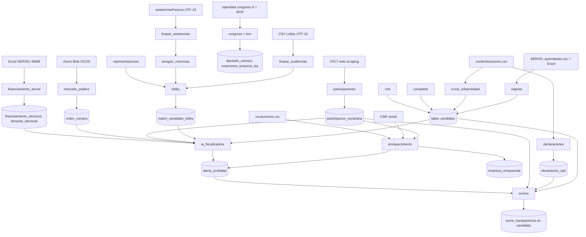

# Flujo del Pipeline — 18 Pasos

Ver [[Mapa_Proyecto]] · [[scripts/Pipeline_Pasos]] · [[arquitectura/Stack_Tecnologico]] · [[db/PostgreSQL]]

---

## Diagrama de flujo



---

## Resumen de pasos

| # | Paso | Tiempo aprox. | Skipeable |
|---|------|---------------|-----------|
| 1 | `limpiar_audiencias` | ~2 min | Si ya existe CSV limpio |
| 2 | `limpiar_asistencias` | ~2 min | Si ya existe CSV limpio |
| 3 | `arreglar_columnas` | <1 min | Si ya existe CSV final |
| 4 | `ingesta` | ~5 min | Si candidato tiene ≥6.685 filas |
| 5 | `representaciones` | ~10 min | Si temp_representaciones >1M filas |
| 6 | `lobby` | ~3 min | Si tablas >500K/100K filas |
| 7 | `congreso` | ~30 min | Con checkpoint progreso_congreso.json |
| 8 | `declaraciones` | ~2 min | Si csvdeclaraciones no tiene más filas |
| 9 | `consolidador` | <1 min | Si no hay archivos _rescatados pendientes |
| 10 | `cruce_infoprobidad` | ~5 min | Si uri_declarante ya está asignado |
| 11 | `completar` | ~2 min | Idempotente |
| 12 | `ruts` | ~20 min | 1.017 pendientes, ~1-2s/candidato |
| 13 | `participaciones` | ~2h+ | 4.766 pendientes, con checkpoint |
| 14 | `enriquecimiento` | ~10 min | Con flags --solo-csv/--solo-cmf |
| 15 | `mercado_publico` | ~15 min | Con checkpoint, filtra por RUTs |
| 16 | `financiamiento_servel` | ~5 min | Debe correr ANTES de `ia` |
| 17 | `ia` (ia_fiscalizadora) | ~20 min | Regenera todas las alertas |
| 18 | `scores` | ~2 min | Recalcula score_transparencia |

---

## Comandos

```bash
# Ver estado sin ejecutar:
.venv/Scripts/python.exe pipeline_maestro.py --estado

# Correr todo:
.venv/Scripts/python.exe pipeline_maestro.py --backup

# Solo pasos específicos:
.venv/Scripts/python.exe pipeline_maestro.py --pasos ia,scores
```

---

*Nota de arquitectura · [[Mapa_Proyecto]] · [[scripts/Pipeline_Pasos]]*
